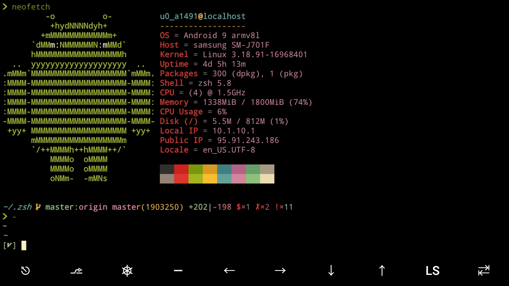
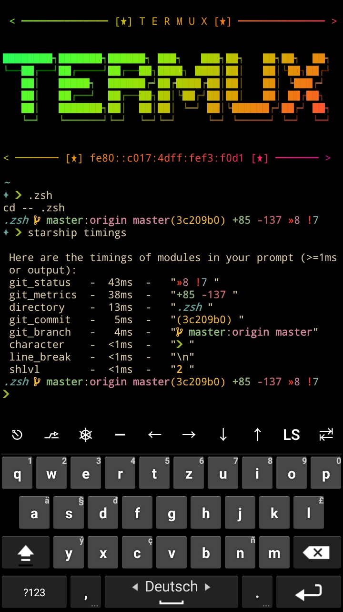

# Termux dotfiles

For **Termux** & **Nvim** on **Android**,with full setup.

### **Dotbare configs**

**Zsh, nvim, fzf, tmux, starship, git, dotbare, vim/lightline, vifm**, micro and more. 
A lot of **plugins, aliases, fzf functions** and a couple scripts.

I'm using too many plugins but only 2 or 3 are essential 
(fast syntax highlighting, zsh-autosuggestions & fzf-tab). 
[oh-my-zsh](https://github.com/ohmyzsh/ohmyzsh)(configured) manages about 10 - 15 plugins. 
***The zsh startup time on Android 9(Sm-j7) is about 0.5 - 0.75 sec*** 
(zsh -i -c exit  0.39s user 0.12s system 85% cpu 0.625 total)

#### **Essential plugins**

[zsh-autosuggestions](https://github.com/zsh-users/zsh-autosuggestions) 
[fast-syntax-highlighting](https://github.com/zdharma-continuum/fast-syntax-highlighting) 
[fzf-tab](https://github.com/Aloxaf/fzf-tab)

#### **Prompt**

[starship](https://github.com/starship/starship) **timings**
- In my home directory
  - directory   -   2ms  -  ~
  - line_break  -   1ms  -  \n
  - character   -   1ms  -  ❯
- In a git repo (oh-my-zsh)
  - git_status  -  43ms  -  »×8 !×7
  - git_metrics -  38ms  -  +68|-115
  - directory   -  13ms  -  ~/.zsh
  - git_commit  -   5ms  -  (93ad3a8)
  - git_branch  -   5ms  -   master:origin/master
  - line_break  -   1ms  -  \n
  - character   -   1ms  -  ❯ 

  

### **TODO**

Migrate to [Zinit](https://github.com/zdharma-continuum/zinit)
or do it without any plugin manager by myself.
