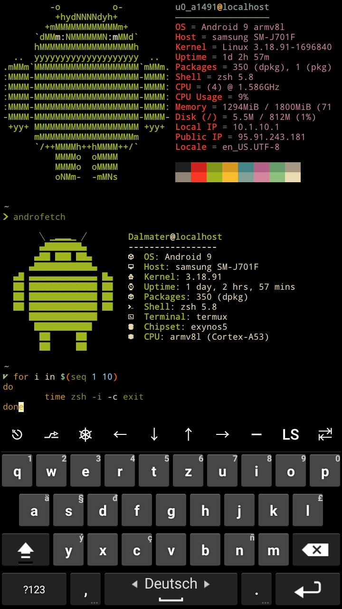

# Termux dotfiles

## ***Just my personal dotfiles***

This is my setup for **Termux** on **Android**. 
With **zsh, fzf, nvim, vim/lightline, starship, Tmux,
git, vifm**, micro and some more.  
Oh, and a lot of **aliases and fzf functions**.

I'm using too many plugins but only 2-3 are essential
to me(fast syntax highlighting, zsh-autosuggestions, fzf-tab). 
I'm using [oh-my-zsh](https://github.com/ohmyzsh/ohmyzsh) as a plugin manager with about 10-15 plugins. 
#### ***Zsh startup time on Android 9(Sm-j7) is about 0.8 - 1.2 sec*** (0.53s user 0.20s system 80% cpu 0.912 total)

#### ***Starship timings***
- In my home directory 
  - directory   -   2ms  -  ~  
  - line_break  -  <1ms  -  \n  
  - character   -  <1ms  -  ❯  

- In a git repo (oh-my-zsh) 
  - git_status   -  44ms  -   $×1 ✘×3 !×10 
  - git_metrics  -  41ms  -   +181|-242 
  - directory    -  13ms  -   ~/.zsh 
  - git_commit   -   5ms  -   (6d5b8484) 
  - git_branch   -   5ms  -    master:origin/master 
  - line_break   -  <1ms  -   \n  
  - character    -  <1ms  -   ❯

#### **Essential plugins** 
[zsh-autosuggestions](https://github.com/zsh-users/zsh-autosuggestions) 
[fast-syntax-highlighting](https://github.com/zdharma/fast-syntax-highlighting) 
[fzf-tab](https://github.com/Aloxaf/fzf-tab)

#### **Prompt**
[starship](https://github.com/starship/starship)

### **TODO**
Migrate to [Zinit](https://github.com/zdharma/zinit)
 
Clean up .zshrc with a zshenv and .zprofile file.
