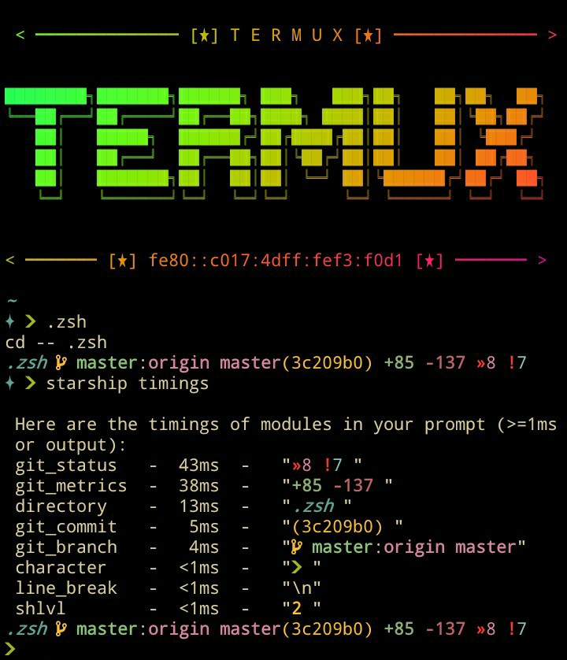

# 
Termux dotfiles

For **Termux/Android** with full setup for **Zsh, neovim, fzf, tmux & completions**. 
With a lot of plugins, aliases, functions, colors and some fonts. 

I'm using too many plugins but only 2 are essential, 5 if using fzf. 
(fast-syntax-highlighting zsh-autosuggestions, fzf fzf-tab & fzf.vim). 
[oh-my-zsh](https://github.com/ohmyzsh/ohmyzsh) (configured) manages some plugins & misc stuff. 
***Zsh startup time on Android 9(Sm-j7) is about 0.5 - 0.7 seconds.*** 
`time zsh -i -c exit`  0.39s user 0.11s system 87% cpu 0.600 total

## *Warning*

There is no backup system!  
If you install this on top of your dotfiles, expect a big mess. 
Do not use the `scripts/install.sh` script!  
You should only pick whatever you want and include it in your own config.

#### Prompt

[starship](https://github.com/starship/starship) **timings**

### Essential plugins

[zsh-autosuggestions](https://github.com/zsh-users/zsh-autosuggestions) 
[fast-syntax-highlighting](https://github.com/zdharma-continuum/fast-syntax-highlighting) 
[fzf](https://github.com/junegunn/fzf.git) [fzf-tab](https://github.com/Aloxaf/fzf-tab) [fzf.vim](https://github.com/junegunn/fzf.vim.git)

#### Plugin manager

[oh-my-zsh](https://github.com/ohmyzsh/ohmyzsh)
[vim-plug](https://github.com/junegunn/vim-plug.git)
[tpm](https://github.com/tmux-plugins/tpm)

##### Other plugins i like

[z.lua](https://github.com/skywind3000/z.lua) 
[dotbare](https://github.com/kazhala/dotbare.git) 
[zsh-autopair](https://github.com/hlissner/zsh-autopair) 
[zsh-hist](https://github.com/marlonrichert/zsh-hist.git) 
[zsh-you-should-use](https://github.com/MichaelAquilina/zsh-you-should-use.git) 
[lightline.vim](https://github.com/itchyny/lightline.vim) 
[vim-visual-multi](https://github.com/mg979/vim-visual-multi.git) 
[vim-gruvbox8](https://github.com/lifepillar/vim-gruvbox8.git) 
[vim-easycomplete](https://github.com/jayli/vim-easycomplete.git) 
[filetype-nvim](https://github.com/nathom/filetype.nvim.git) 
[starship](https://github.com/starship/starship.git)

More vim/nvim plugins in .config/nvim/init.vim(top)  Tmux plugins in .config/tmux/tmux.conf(bottom)
